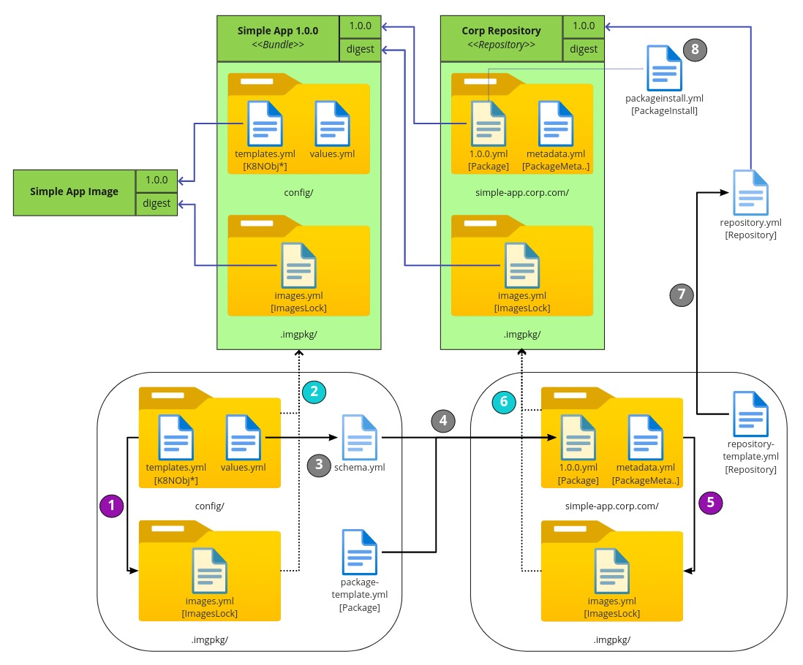

# Carvel Repository Example

This project aims to build GitHub workflows that allow managing a Carvel packages repository.
These workflows are not trying to set a standard. They only intend to show a way to automate the management of a repository.

The steps and the examples were taken from the [packaging tutorial](https://carvel.dev/kapp-controller/docs/v0.34.0/packaging-tutorial/).

We chose to use a mono-repo to simplify the example, but this may not be the best in all cases. It would be easy to adapt workflows to 
teams with other dynamics. 

As container registry we are using GitHub Container Registry. For workflows to be able to push images to the registry, it's required
that [workflows have access](https://docs.github.com/en/packages/learn-github-packages/configuring-a-packages-access-control-and-visibility#ensuring-workflow-access-to-your-package).
Keep in mind that to give access it is necessary to create the package by hand first.



## package: simple-app

In this example, we only manage one package, but a single repo can handle multiple packages.
This example can be adapted for various packages by adding their configuration and workflows.

Each package has, at least, this files:

- bundle/config/config.yml : template with the Kubernetes objects
- bundle/config/values.yml : default values used in templates. Includes descriptions
- package-template.yml : template to build the package CRD

### How to use modify a package

After modify the package source you must invoke `kbld` to record the images used, in order to have immutable images references.

```shell
$ kbld -f simple-app/bundle/config/ --imgpkg-lock-output simple-app/bundle/.imgpkg/images.yml
```

### Workflow

The [Workflow](.github/workflows/build-simple-app.yml) is launched on a new tag and performs the next steps :

1. Push the [package bundle](simple-app/bundle) to GitHub Container Registry
2. Generate a new Package CRD and commit it to GitHub.
3. Push the repository oci to GitHub Container Registry
4. Create a new release
5. Generate a new PackageRepository CRD and attach it to the release

## Repository

TODO

### How to use the repository

1. [Install kapp-controller dependencies](https://carvel.dev/kapp-controller/docs/v0.34.0/packaging-tutorial/#installing-kapp-controller-dependencies)
2. [Install kapp-controller](https://carvel.dev/kapp-controller/docs/v0.34.0/packaging-tutorial/#i-believe-i-was-promised-kapp-controller)
3. Install the generated repository
    ```shell
    $ kubectl apply -f https://github.com/javierfreire/carvel-repository-example/releases/latest/download/package_repository_cr.yml
    ```
4. Now, you can list the package metadatas
    ```shell
    $ kubectl get packagemetadatas
    ```
5. Create an installation
    ```shell
    $cat > pkginstall.yml << EOF
    ---
    apiVersion: packaging.carvel.dev/v1alpha1
    kind: PackageInstall
    metadata:
      name: pkg-demo
    spec:
      serviceAccountName: default-ns-sa
      packageRef:
        refName: simple-app.corp.com
        versionSelection:
          constraints: 1.0.0
      values:
      - secretRef:
          name: pkg-demo-values
    ---
    apiVersion: v1
    kind: Secret
    metadata:
      name: pkg-demo-values
    stringData:
      values.yml: |
        ---
        hello_msg: "to all my internet friends"
    EOF
    ```
6. Install package
    ```shell
   $ kubectl apply -f pkginstall.yml
    ```

## TODO

- [ ] Launch a cp pipeline on a pull request