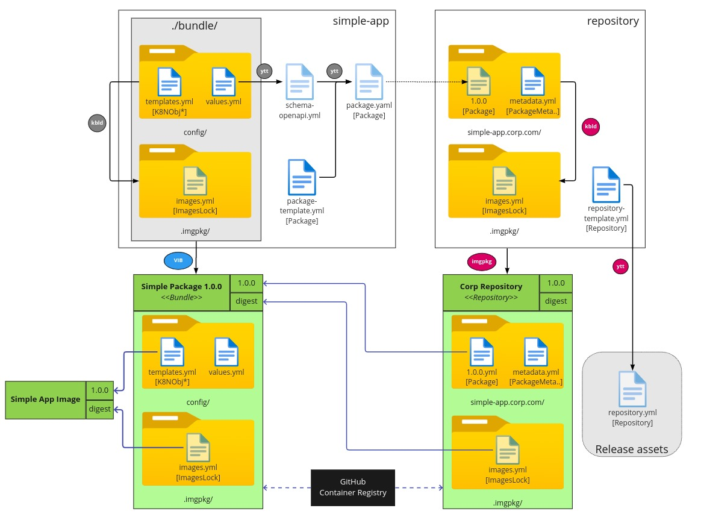

# Carvel Repository Example

This project has been developed for demonstration purposes only.

It is intended to show how to manage a Carvel package and its repository using GitHub workflows and
[VMware Image Builder service](https://github.com/vmware-labs/vmware-image-builder-action).
The registry will contain a single package: simple-app, which defines a very simple service.

For its development, the steps and examples of the
[Carvel Packaging tutorial](https://carvel.dev/kapp-controller/docs/v0.34.0/packaging-tutorial/) have been followed.

This project consists of 2 components:
- simple-app: with the package information
- repository: with the repository data

Note: As container registry we are using GitHub Container Registry. For workflows to be able to push images to the registry, it's required
that [workflows have access](https://docs.github.com/en/packages/learn-github-packages/configuring-a-packages-access-control-and-visibility#ensuring-workflow-access-to-your-package).
Keep in mind that to give access it is necessary to create the package by hand first.

## Versioning process

### Prepare the package

After making any changes in simple-app and before committing it, it is necessary to execute [./bundle/prepare-version.sh]

```bash
$ ./bundle/prepare-version.sh 1.0.0
```

This script will do the following:

- Record the images used with `kbld`, in order to have immutable images references
- Generate an OpenApI schema from the [value.yaml](./simple-app/bundle/config/values.yml) file, which defines how to configure the package
- Generate the Package CRD, which will include the OpenAPI schema.

### Pack, verify and publish the package

Once the package is prepared, the commit can be done. This will launch a [workflow](.github/workflows/simple-app.yml) that will use a
[VIB pipeline](.vib/simple-app.json).  to pack, verify, and publish the package easily and efficiently:

- Pack simple-app
- Provision of a cluster on GKE
- Deploy simple-app in the new cluster
- Perform resilience tests, creating and deleting pods.
- Generate a Trivy report to discover vulnerabilities.
- Undeploy simple-app
- Unprovision the cluster
- If all went ok, publish the package to the OCI registry

### Update the repository and publish it

After publish the package will be launched the second job of the [workflow](.github/workflows/simple-app.yml):
- Copy the package CR to repository renames as the version.
- Record which package bundles are used with `kbld`.
- Commit repository changes
- Push the repository bundle to the OCI registry
- Create the PackageRepository CR
- Create a new Release in GitHub
- Upload the PackageRepository as a release asset



## How to use the repository

1. [Install kapp-controller dependencies](https://carvel.dev/kapp-controller/docs/v0.34.0/packaging-tutorial/#installing-kapp-controller-dependencies)
2. [Install kapp-controller](https://carvel.dev/kapp-controller/docs/v0.34.0/packaging-tutorial/#i-believe-i-was-promised-kapp-controller)
3. Install the generated repository
    ```shell
    $ kubectl apply -f https://github.com/javierfreire/carvel-repository-example/releases/latest/download/package_repository_cr.yml
    ```
4. Now, you can list the package metadatas and the packages
    ```shell
    $ kubectl get packagemetadatas
   
    $ kubectl get packages
    ```
5. Create an installation
    ```shell
    $ cat > pkginstall.yml << EOF
    ---
    apiVersion: packaging.carvel.dev/v1alpha1
    kind: PackageInstall
    metadata:
      name: pkg-demo
    spec:
      serviceAccountName: default-ns-sa
      packageRef:
        refName: simple-app.corp.org
        versionSelection:
          constraints: 1.0.0
    EOF
    ```
6. Create default service account  
    ```shell
    $ kapp deploy -a default-ns-rbac -f https://raw.githubusercontent.com/vmware-tanzu/carvel-kapp-controller/develop/examples/rbac/default-ns.yml -y
    ```
8. Install package
    ```shell
    $ kapp deploy -a pkg-demo -f pkginstall.yml -y
    ```
